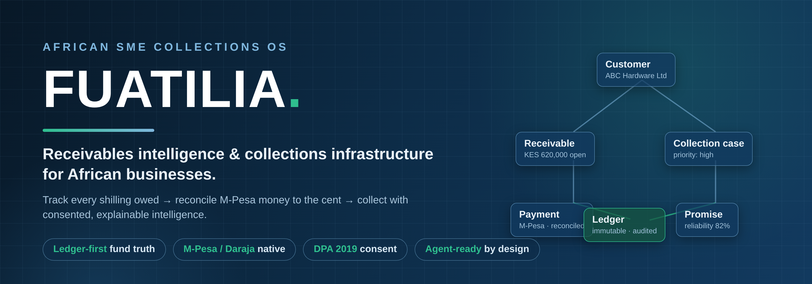
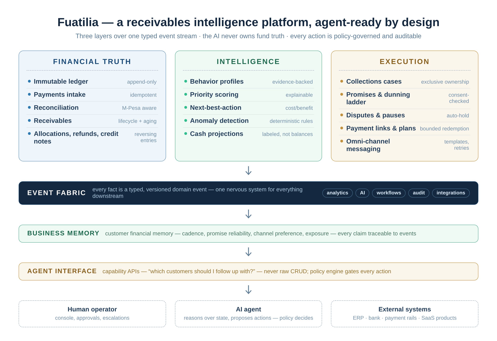
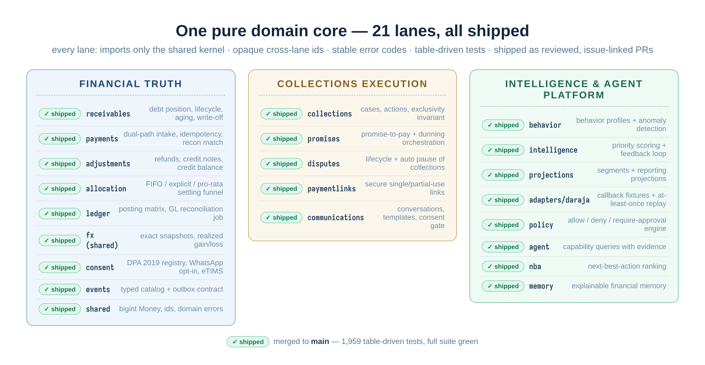

<div align="center">



[](https://github.com/Roy-Wanyoike/fuatilia/actions/workflows/ci.yml)


[](LICENSE)

**Fuatilia** — *kufuatilia* (Swahili): **to keep track of, to follow up on.**

An AI-native Accounts-Receivable & Collections platform for Kenya: track every shilling a
customer owes, reconcile it against M-Pesa money (Daraja) without losing a cent, and follow up
with consented, explainable, intelligence-driven collections.

</div>

---

## Why this exists

African SMEs don't fail because nobody owes them money — they fail because **collecting is
manual, error-prone, and blind**. Invoices live in spreadsheets, M-Pesa payments arrive with
vague references, follow-ups depend on whoever remembers, and nobody can answer four simple
questions:

> **WHO owes us? HOW MUCH do they owe? WHEN are they likely to pay? WHAT should we do next?**

Fuatilia is built to answer those four questions continuously — and then **execute** the answer
through WhatsApp, SMS, email, payment links, payment plans and human collectors, reconciling
every shilling back to the ledger. The platform gets smarter as transaction and collection
history grows.

## What it is

<div align="center">

</div>

A **pure TypeScript domain core** (no database, no network — deliberately) organized as
independent module lanes over a typed event stream. Money is `bigint` minor units. Daraja
callbacks are treated as untrusted and at-least-once. Intelligence reads events; it can never
move money.

## Design principles

1. **Ledger-first fund truth** — payments, allocations, refunds, and credit notes are append-only
   facts; corrections are reversing entries, never edits.
2. **The intelligence layer never owns fund truth** — scoring and recommendations read events;
   they cannot move money.
3. **Channel input is untrusted** — Daraja callbacks are at-least-once; intake is idempotent by
   construction (`unique(channel, externalRef)`).
4. **Kenya-native** — M-Pesa/Daraja, eTIMS invoice numbering, DPA 2019 consent, WhatsApp opt-in.
5. **Agent-ready by design** — Fuatilia exposes financial capabilities through governed APIs and
   events so humans, software integrations, and AI agents can safely reason over and act on
   receivables without bypassing financial controls. The long-term thesis lives in
   [`docs/VISION.md`](docs/VISION.md).

## What's inside

<div align="center">

</div>

| Group | Lane | What it owns |
|---|---|---|
| **Financial Truth** | `receivables` | Invoice→Receivable split, lifecycle states, aging, write-off ownership |
| | `payments` | Dual-path intake (C2B + STK), idempotency keys, reconciliation match |
| | `adjustments` | Refunds + refund allocations, credit notes, customer credit balance |
| | `allocation` | The settling funnel — FIFO / explicit / pro-rata on exact-rational `Money.allocate` |
| | `ledger` | Sub-ledger posting matrix, GL reconciliation job, append-only reversals |
| | `shared` (+ FX) | `bigint` minor-unit Money, banker's rounding, exact FX snapshots + realized gain/loss |
| | `consent` | DPA 2019 consent registry, WhatsApp opt-in, eTIMS numbering hooks |
| | `events` | Typed event catalog (27+ events) + transactional outbox contract |
| **Collections Execution** | `collections` | Cases, actions, one-open-case-per-receivable exclusivity, derived status |
| | `promises` | Promise-to-pay lifecycle + consent-checked dunning orchestration |
| | `disputes` | Dispute lifecycle that automatically pauses collections, resume on resolution |
| | `paymentlinks` | Secure single/partial-use payment links with bounded redemption |
| | `communications` | Conversations, immutable template versions, retry → dead-letter, consent gate |
| **Intelligence & Agent Platform** | `behavior` | Customer behavior profiles + explainable anomaly detection |
| | `intelligence` | Collections priority scoring + recommendation feedback loop |
| | `projections` | Segment strategies + reporting projections (always labeled, never balances) |
| | `adapters/daraja` | Callback conformance suite — fixtures + at-least-once replay |
| | `policy` | Deterministic allow / deny / require-approval engine gating automated actions |
| | `agent` | Capability queries (financial state, priorities, recommendations) with evidence |
| | `nba` | Next-best-action ranking — explainable, policy-filtered, feedback-aware |
| | `memory` | Event-derived customer financial memory, every claim traceable |

## Engineering that matters

- **Pure domain core** — `src/domain/**` has zero I/O. No DB, no clock, no RNG: time and
  randomness are injected, so every outcome is deterministic and every test is hermetic.
- **Money is `bigint` minor units** — no floats anywhere in the money path; one exact-rational
  allocation step and a single banker's-rounding point at the edge.
- **Idempotency as an invariant, not a feature** — duplicate Daraja callbacks, link redemptions
  and promise settlements replay to the *same* result, with tripwire events when replays are
  observed.
- **A typed event fabric** — every meaningful fact is a versioned domain event with a narrow
  serializable payload; the outbox contract is part of the catalog.
- **Stable machine-readable errors** — `SCREAMING_SNAKE` domain error codes (`LINK_TOKEN_MALFORMED`,
  `DUNNING_CONSENT_REQUIRED`, …) that tests and callers can pin against.
- **Table-driven testing culture** — legal/illegal transition grids, boundary tables (±1 ms),
  idempotency suites, no-mutation pins, fake-clock determinism.
- **Invariants as code (R1–R10)** — e.g. *no cent is created or destroyed by allocation*,
  *cross-currency settlement blocked without an FX snapshot*, *one open case per receivable*.
- **PR-per-feature discipline** — every lane ships from its own branch against a tracked GitHub
  issue, squash-merged only after the full suite is green locally and in CI.

## Verification

```bash
npm ci
npm run typecheck   # strict TypeScript
npm test            # full domain suite
```

**1,959 tests across 77 suites**, all green on Node 24 before any merge.
Domain tests are pure — the whole suite runs in seconds with no mocks of infrastructure,
because there is no infrastructure to mock.

## Quickstart

```bash
git clone https://github.com/Roy-Wanyoike/fuatilia.git
cd fuatilia && npm ci && npm test
```

Requires Node ≥ 22.

## How we ship

- Features land as **pull requests** from `feat/*` branches — never direct to `main`.
- A PR merges only when the feature is **done, tested, verified, and working**: local tests
  green, CI green on Node 22/24, diff reviewed. Every PR closes a tracked issue (`Closes #N`).
- Squash-merge only; branches auto-delete.
- The dispatch board of pending features lives in [`docs/BACKLOG.md`](docs/BACKLOG.md).
- Reports and binaries are deliberately kept out of the repository (see `.gitignore`).

## Documentation

| Doc | Contents |
|---|---|
| [`docs/README.md`](docs/README.md) | Index — start here |
| [`docs/VISION.md`](docs/VISION.md) | The 10–15 year product thesis: the receivables intelligence layer that AI agents, payment rails, banks and ERPs plug into |
| [`docs/01-context-map.md`](docs/01-context-map.md) | Bounded contexts + phase-by-phase money flow |
| [`docs/02-domain-model.md`](docs/02-domain-model.md) | Entities, aggregates, relationships (ER clusters) |
| [`docs/03-state-machines.md`](docs/03-state-machines.md) | Invoice, receivable, payment, case, promise, installment, dispute |
| [`docs/04-event-catalog.md`](docs/04-event-catalog.md) | The typed domain event catalog + envelope contract |
| [`docs/05-data-dictionary.md`](docs/05-data-dictionary.md) | Fields, money semantics, id formats |
| [`docs/06-review-findings.md`](docs/06-review-findings.md) | Design review findings (C1–C5 critical, H1–H7 high, K1–K6 Kenya/compliance) |
| [`docs/07-invariants.md`](docs/07-invariants.md) | R1–R10 testable invariants |
| [`docs/08-build-plan.md`](docs/08-build-plan.md) | Three-phase build order + definition of done |
| [`docs/SPEC.md`](docs/SPEC.md) | Original master build requirements (the "classic code" brief) |
| [`docs/BACKLOG.md`](docs/BACKLOG.md) | Live feature dispatch board (waves 1–5) |

## Roadmap

| Wave | Theme | Status |
|---|---|---|
| 1 | Fund truth: receivables, payments, adjustments | ✅ merged |
| 2 | Allocation engine, event catalog, late fees + plans, consent/eTIMS | ✅ merged |
| 3 | Collections ops: cases, ledger, FX, promises/dunning, disputes, links, comms | ✅ merged |
| 4 | Intelligence: priority scoring, projections, Daraja conformance, behavior profiles | ✅ merged |
| 5 | Agent-ready platform: policy engine, agent capabilities, next-best-action, financial memory | ✅ merged |
| 6 | HTTP/API transport + auth (the domain core is complete — this is next) | ⏳ deliberate deferral |

## Ecosystem

Fuatilia is the **receivables intelligence layer** of a Kenyan fintech family: payment products
**move** money, Fuatilia **understands and collects** it — construction SaaS (MjengoOS) and other
products can embed *"Collections powered by Fuatilia"* instead of rebuilding AR. Sister project:
[`digital-lending-os`](https://github.com/Roy-Wanyoike/digital-lending-os).

## License

[MIT](LICENSE)
