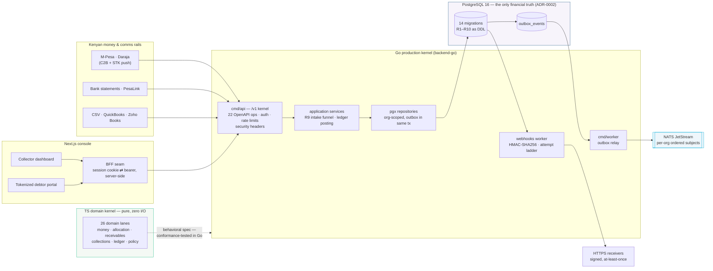

<div align="center">


# **Fuatilia** — *kufuatilia* (Swahili): **to keep track of, to follow up on**

### THE AI-native receivables intelligence & collections infrastructure for Africa

Track every shilling a customer owes, reconcile it against M-Pesa and bank money without
losing a cent, and follow up with consented, explainable, intelligence-driven collections —
the financial truth layer that AI agents, payment rails, ERPs and banks can safely plug into.

[](docs/ops/CI-BILLING-BLOCKER.md)
[](#proof-the-gate-matrix)
[](#proof-the-gate-matrix)
[](#proof-the-gate-matrix)
[](#proof-the-gate-matrix)
[](api/openapi/fuatilia.v1.yaml)


[](LICENSE)

*Every gate number above was re-run on the tagged commit — see the [gate matrix](#proof-the-gate-matrix).*

</div>

---

## Why this exists

African SMEs don't fail because nobody owes them money — they fail because **collecting is
manual, error-prone, and blind**. Invoices live in spreadsheets, M-Pesa payments arrive with
vague references, follow-ups depend on whoever remembers, and nobody can answer four simple
questions:

> **WHO owes us? HOW MUCH do they owe? WHEN are they likely to pay? WHAT should we do next?**

Fuatilia answers those four questions continuously — and then **executes** the answer through
WhatsApp, SMS, email, payment links, payment plans and human collectors, reconciling every
shilling back to the ledger.

## What it is

A **pure TypeScript domain kernel** (26 lanes, zero I/O, `bigint` minor-unit money) that serves
as the *behavioral specification*; a **Go production kernel** that serves the OpenAPI `/v1`
surface over **PostgreSQL as the only financial truth**; a **transactional outbox → NATS
JetStream** event fabric; **HMAC-signed webhook delivery** with an at-least-once attempt ladder;
and a **Next.js console** — collector dashboard plus a tokenized self-service debtor portal.
Intelligence reads events; it can never move money (ADR-0005: the policy engine + approvals +
audit trail is the only execution path — [docs/DECISIONS.md](docs/DECISIONS.md)).



Every box above is code in this tree — trace each one:
`src/domain/**` (kernel) · `backend-go/cmd/api` + `internal/{transport,application,repositories}`
(`/v1` + truth) · `backend-go/internal/outbox` + `cmd/worker` (relay) ·
`backend-go/internal/webhooks` (delivery) · `db/migrations` (DDL) ·
`docker-compose.yml` (the boot order) · `frontend/src/app/(dashboard)|(portal)|(auth)` (console).

## Financial invariants — R1–R10, proven not promised

The code must *guarantee* these rules; each maps to tests in the domain lanes and to
constraints in the PostgreSQL DDL (full text: [`docs/07-invariants.md`](docs/07-invariants.md),
DDL map: [`db/README.md`](db/README.md)):

| # | Invariant | Enforced by |
|---|-----------|-------------|
| R1 | **Balance integrity** — `balance = original − Σ allocations − Σ credit applications`; never negative; `settled ⇔ balance = 0` | `src/domain/allocation` · DDL `0004`/`0006` (GENERATED + CHECK) |
| R2 | **No over-allocation** — Σ allocations of a payment ≤ confirmed; remainder stays `unapplied` | allocation lane · DDL `0006` COMMIT proof |
| R3 | **Append-only postings** — allocations, matches, refunds, ledger entries are never edited; corrections are reversing entries with a reason | DDL `0008`/`0013` refuse `UPDATE`/`DELETE` |
| R4 | **Ledger completeness** — every money-moving change posts per the posting matrix; `Σdebit = Σcredit` at COMMIT | DDL `0008` COMMIT proof |
| R5 | **Match points at Payment** — N receivables per payment are expressed through allocations, never direct linkage | DDL `0005`/`0008` posting whitelist |
| R6 | **Refund ceiling** — refunds draw only on unallocated confirmed funds | adjustments lane · DDL `0007` |
| R7 | **Credit ceilings** — Σ credit-note applications ≤ note total; excess requires consent and lands in customer credit balance | adjustments lane · DDL `0007` |
| R8 | **Case exclusivity** — at most one open collections case per receivable | collections lane · partial UNIQUE `0009` |
| R9 | **Idempotent intake** — `unique(channel, externalRef)`; a duplicate callback returns the existing payment and raises a tripwire event | payments lane · DDL `0005`/`0013` |
| R10 | **Currency discipline** — single-currency arithmetic; cross-currency settlement requires an explicit FX posting with realized gain/loss | shared kernel · DDL `0008`/`0014` |

`bash db/validate.sh` proves the DDL actually *fires* — 25 assertions on a throwaway real
PostgreSQL 16 cluster, including double-applied migrations as a no-op (all green, see below).

## Proof: the gate matrix

Numbers below were **executed on this commit** (Node 24.19, Go 1.23.4, PostgreSQL 16.4, 2026-09-10).
Rerun them yourself — nothing is hand-waved:

| Gate | Command | Result |
|---|---|---|
| TS kernel + adapters, typecheck | `npm run typecheck` | ✅ clean (0 errors) |
| TS kernel + adapters, suite | `FUATILIA_TEST_DATABASE_URL=postgres://postgres@127.0.0.1:5435/fuatilia_pgadapters_test npx vitest run` | ✅ **131 files · 2,997/2,997** (36s) |
| Frontend, typecheck | `npm run typecheck` (in `frontend/`) | ✅ clean |
| Frontend, suite | `npx vitest run` (in `frontend/`) | ✅ **21 files · 202/202** (26s) |
| Go, format + vet | `gofmt -l .` · `go vet ./...` (in `backend-go/`) | ✅ both clean |
| Go, suite under `-race` vs real PG | `FUATILIA_TEST_PGBIN=<pg16-bin> go test ./... -race` (in `backend-go/`) | ✅ **9 packages · 215/215** top-level tests `ok` |
| Schema invariant proof | `bash db/validate.sh` | ✅ **25/25 assertions · ALL GATES GREEN** (migrate ×2 idempotent) |
| Deploy contract (static) | `python3 scripts/validate_deploy.py` | ⚠️ 1 false-positive — see note below |
| GitHub Actions CI | workflows hardened in #150 | ⛔ **blocked by account billing lock** — [`docs/ops/CI-BILLING-BLOCKER.md`](docs/ops/CI-BILLING-BLOCKER.md) (owner action; workflows ready, not yet executed by Actions) |

> ℹ️ `make validate` currently reports one failure: the env-contract scanner (from PR #154)
> reads every `os.Getenv(...)` in non-test Go sources, so it now catches the OS-standard
> `os.Getenv("PATH")` added by PR #151 (`backend-go/internal/infra/pgtest/pgtest.go:444`) and
> demands a `PATH` key in `.env.example`. The fix is a validator allowlist for OS-reserved
> variables — outside this docs lane; flagged for follow-up. All other validator gates pass.

Or run everything with one target: **`make gate`** (typecheck ×2 → vitest ×2 → gofmt → go vet
→ `go test ./... -race`). The suites refuse to skip: an unreachable PostgreSQL cluster fails
the gate loudly instead of passing green.

## 60-second quickstart

The full stack boots from one file — [`docker-compose.yml`](docker-compose.yml) — in the exact
order the code requires (`postgres` healthy → `migrate` → `api` → `worker`; `nats` healthy →
`worker`; `api` healthy → `frontend`):

```bash
git clone https://github.com/Roy-Wanyoike/fuatilia.git && cd fuatilia
cp .env.example .env                # then set POSTGRES_PASSWORD + DATABASE_URL (no CHANGE_ME left)
make up                             # builds + boots: PG, migrate, NATS, api :8080, worker, web :3000
make smoke                          # 4 probes: api /v1/health · /v1/meta · web / · BFF 401 fail-closed
open http://localhost:3000          # console — API meta at http://localhost:8080/v1/meta
```

Targets verified in the [`Makefile`](Makefile): `up` · `down` · `logs` · `smoke` · `gate` ·
`typecheck` · `vitest` · `gofmt` · `govet` · `gotest` · `validate` · `help`.
Prefer it by hand? `npm ci && npm test` (Node ≥ 22) runs the pure domain suite in seconds —
there is no infrastructure to mock, because the kernel doesn't touch any.
Deploy specifics and the env contract: [`docs/DEPLOY.md`](docs/DEPLOY.md).

## Status: shipped vs deferred — the honest board

**Shipped and merged to `main`** (each row = squash-merged PRs that closed their tracked issue):

| Capability | Evidence |
|---|---|
| TS domain kernel — 26 pure lanes, `bigint` minor-unit money, 27+ typed events, outbox contract | `src/domain/**` · waves 1–8, PRs #11–#63 ([docs/BACKLOG.md](docs/BACKLOG.md)) |
| OpenAPI 3.1 `/v1` contract — 22 ops mounted, parity test locks drift | [api/openapi/fuatilia.v1.yaml](api/openapi/fuatilia.v1.yaml) · Go kernel #72 |
| PostgreSQL financial truth — 14 forward-only migrations, R1–R10 as DDL | [db/](db/README.md) · proven by `db/validate.sh` |
| Go `/v1` kernel — envelopes, cursor pagination, auth middleware, audited denials | `backend-go/internal/transport` · #72 |
| Transactional outbox → NATS JetStream — crash-safe, per-org ordered, DLQ + replay | `backend-go/internal/outbox` · #74 |
| Webhook delivery worker — HMAC-SHA256, `SKIP LOCKED` claim, retry ladder, at-least-once proven on real PG | `backend-go/internal/webhooks` · #125 (Closes #91) |
| Daraja production client (Go) — OAuth single-flight, retry ladder, K1 wire parity, refusal taxonomy | `backend-go/internal/daraja` · #97 + #156 (Closes #84) |
| STK push as a policy-gated collections execution action | #113 (Closes #92) |
| Intake adapters — CSV bulk import + QuickBooks/Zoho mapping; PesaLink/bank-statement reconciliation | `src/adapters/intake` · #116 (Closes #87) · `src/adapters/bankfeed` · #118 (Closes #117) |
| Comms provider adapters — SMS · SMTP email · WhatsApp Cloud API (wire-idempotent, consent-gated) | `src/adapters/comm-*` · #112 · #152 (Closes #127) · #155 (Closes #128) |
| Debtor portal — tokenized balance / invoices / statements, fail-closed BFF | `frontend/src/app/(portal)` · #124 (Closes #86) |
| Collector sign-in — HttpOnly SameSite=Strict session cookie, middleware gate | `frontend/src/app/(auth)` · #153 (Closes #133) |
| Rate limiting + security headers — token bucket, CSP `default-src 'none'`, opt-in HSTS | `backend-go/internal/transport/ratelimit.go` · #157 (Closes #130) |
| Deploy stack — 6-service compose, 3-stage pinned Dockerfiles, env-contract validator, Makefile | [docker-compose.yml](docker-compose.yml) · #154 (Closes #138), foundation #75/#77 |
| CI workflows — hardened, PG service wired, manual dispatch (activation pending, below) | `.github/workflows/*` · #150 (Closes #139) |

**Deferred / in flight** (tracked, not faked — nothing on this list is claimed as working):

| Item | Status |
|---|---|
| OpenTelemetry tracing + Prometheus metrics | open — issue #88, no code in tree yet |
| ClickHouse analytics read-model (DSO, aging migration, collector effectiveness) | open — issue #89; the event fabric emits to JetStream, the warehouse driver is not wired |
| Go background scheduler — dunning ladder, late fees, plan expiry, aging snapshots | open — issue #126 |
| eTIMS KRA numbering source | open — issue #129; the injected `sequenceSource` port exists in `src/domain/consent/etims.ts` |
| Ledger + adjustments `/v1` operations | open — issue #132 |
| Customer 360 + collections case workspace UI | open — issues #134, #135 |
| Portal pay-now link redemption, plan submission, view audit | deliberately deferred in PR #124 — the `/v1` endpoints they need are not mounted; nothing faked |
| Temporal durable workflows (SPEC §40) | decided, not started — ADR-0004 ([docs/DECISIONS.md](docs/DECISIONS.md)) |
| GitHub Actions runs | blocked by account billing lock — owner action, documented in [docs/ops/CI-BILLING-BLOCKER.md](docs/ops/CI-BILLING-BLOCKER.md) |
| Frontend production build | `next build` repair tracked in #158 (vitest + typecheck green; CI job runs the scripts the workflow defines) |

## What's inside (lane map)

<div align="center">

</div>

| Group | Lane | What it owns |
|---|---|---|
| **Financial Truth** | `receivables` | Invoice→Receivable split, lifecycle states, aging, write-off ownership |
| | `payments` | Dual-path intake (C2B + STK), idempotency keys, reconciliation match |
| | `adjustments` | Refunds + refund allocations, credit notes, customer credit balance |
| | `allocation` | The settling funnel — FIFO / explicit / pro-rata on exact-rational `Money.allocate` |
| | `ledger` | Sub-ledger posting matrix, GL reconciliation job, append-only reversals |
| | `shared` (+ FX) | `bigint` minor-unit Money, banker's rounding, exact FX snapshots + realized gain/loss |
| | `consent` | DPA 2019 consent registry, WhatsApp opt-in, eTIMS numbering hooks |
| | `events` | Typed event catalog (27+ events) + transactional outbox contract |
| **Collections Execution** | `collections` | Cases, actions, one-open-case-per-receivable exclusivity, derived status |
| | `promises` | Promise-to-pay lifecycle + consent-checked dunning orchestration |
| | `disputes` | Dispute lifecycle that automatically pauses collections, resume on resolution |
| | `paymentlinks` | Secure single/partial-use payment links with bounded redemption |
| | `communications` | Conversations, immutable template versions, retry → dead-letter, consent gate |
| **Intelligence & Agent Platform** | `behavior` | Customer behavior profiles + explainable anomaly detection |
| | `auth` | Org-scoped users, RBAC permission matrix, API keys, sessions — deny-by-default with audited denials |
| | `webhooks` | Endpoint registry, subscription grammar, pure signing contract, retry → dead-letter |
| | `crossborder` | Corridors, exact-rational FX quotes with expiry, transfer intents with idempotent submit |
| | `intelligence` | Collections priority scoring + recommendation feedback loop |
| | `projections` | Segment strategies + reporting projections (always labeled, never balances) |
| | `policy` | Deterministic allow / deny / require-approval engine gating automated actions |
| | `agent` | Capability queries (financial state, priorities, recommendations) with evidence |
| | `nba` | Next-best-action ranking — explainable, policy-filtered, feedback-aware |
| | `memory` | Event-derived customer financial memory, every claim traceable |
| | `approvals` | Maker-checker approval workflows — org policies, distinct-approver quorum, self-approval guard |
| | `audit` | Unified append-only audit trail — redaction, hash-chain integrity, event projection |
| | `ussd` | USSD session state machine + five low-tech flows over read-only capability ports |
| **Transport** | `adapters/http` | Zero-dep TS `/v1` kernel — router, §38 error mapping, pagination, auth middleware |
| | `adapters/persistence` | File-backed AuthStore (JSONL journal, crash-atomic snapshots) + **PG adapters** over `db/migrations` |
| **Adapters (untrusted edges)** | `adapters/daraja` | M-Pesa/Daraja conformance suite — fixtures + at-least-once replay; Go twin in `backend-go/internal/daraja` |
| | `adapters/intake` | Bulk CSV invoice import + QuickBooks/Zoho Books mapping (#116) |
| | `adapters/bankfeed` | Bank-statement normalization into the payments match core (#118) |
| | `adapters/comm-sms` · `comm-email` · `comm-whatsapp` | SMS, SMTP and WhatsApp Cloud API provider adapters — wire-idempotent, refusal-taxonomied |

## Engineering that matters

- **Pure domain core** — `src/domain/**` has zero I/O. No DB, no clock, no RNG: time and
  randomness are injected, so every outcome is deterministic and every test is hermetic.
- **Money is `bigint` minor units** — no floats anywhere in the money path; one exact-rational
  allocation step and a single banker's-rounding point at the edge. The Go `pkg/money` port is
  conformance-tested against the TS spec scenario-for-scenario (`backend-go/pkg/money/conformance_test.go`).
- **Idempotency as an invariant, not a feature** — duplicate Daraja callbacks, link redemptions
  and promise settlements replay to the *same* result, with tripwire events when replays are
  observed (R9).
- **A typed event fabric** — every meaningful fact is a versioned domain event with a narrow
  serializable payload; the outbox contract is part of the catalog, and the relay preserves
  per-org ordering on NATS JetStream subjects.
- **Stable machine-readable errors** — `SCREAMING_SNAKE` domain error codes (`LINK_TOKEN_MALFORMED`,
  `DUNNING_CONSENT_REQUIRED`, …) that tests and callers pin against, mirrored 1:1 across TS and Go.
- **Table-driven testing culture** — legal/illegal transition grids, boundary tables (±1 ms),
  idempotency suites, no-mutation pins, fake-clock determinism, race-detector runs against real
  ephemeral PostgreSQL (`internal/infra/pgtest` boots throwaway 16.4 clusters per suite).
- **PR-per-feature discipline** — every lane ships from its own branch against a tracked GitHub
  issue, squash-merged only after the full gate is green locally (and in CI, once billing unblocks).

## Documentation

| Doc | Contents |
|---|---|
| [`docs/README.md`](docs/README.md) | Full documentation hub — design docs, ops, status, per-lane guides |
| [`docs/VISION.md`](docs/VISION.md) | The 10–15 year product thesis: the receivables intelligence layer that AI agents, payment rails, banks and ERPs plug into |
| [`docs/07-invariants.md`](docs/07-invariants.md) | R1–R10, the testable rules the code must guarantee |
| [`docs/DEPLOY.md`](docs/DEPLOY.md) | Compose stack, env contract, what the deploy validator does and does not prove |
| [`docs/ops/CI-BILLING-BLOCKER.md`](docs/ops/CI-BILLING-BLOCKER.md) | Why Actions is red, evidence, and the local-gate parity commands |
| [`docs/BACKLOG.md`](docs/BACKLOG.md) | Live feature dispatch board (waves 1–11) |

## Contributing

`CONTRIBUTING.md` + `ARCHITECTURE.md` — the engineering handbook — are **landing in issue #141**;
until then, ["How we ship"](#how-we-ship) below is the working contract, and every open lane is
a tracked issue. Start from [`docs/README.md`](docs/README.md).

## How we ship

- Features land as **pull requests** from feature branches — never direct to `main`.
- A PR merges only when the feature is **done, tested, verified, and working**: the full local
  gate green (the matrix above), diff reviewed. Every PR closes a tracked issue (`Closes #N`).
- Squash-merge only; branches auto-delete. CI gates re-activate the moment the billing blocker
  clears — no workflow changes needed ([evidence](docs/ops/CI-BILLING-BLOCKER.md)).
- Reports and binaries are deliberately kept out of the repository (see `.gitignore`).

## Ecosystem

Fuatilia is the **receivables intelligence layer** of a Kenyan fintech family: payment products
**move** money, Fuatilia **understands and collects** it — construction SaaS (MjengoOS) and other
products can embed *"Collections powered by Fuatilia"* instead of rebuilding AR. Sister project:
[`digital-lending-os`](https://github.com/Roy-Wanyoike/digital-lending-os).

## License

[MIT](LICENSE)
