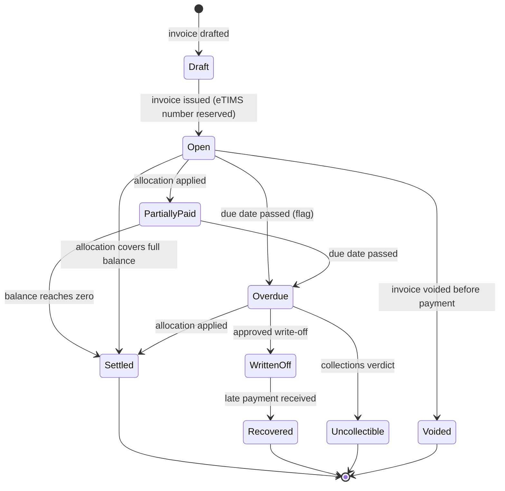
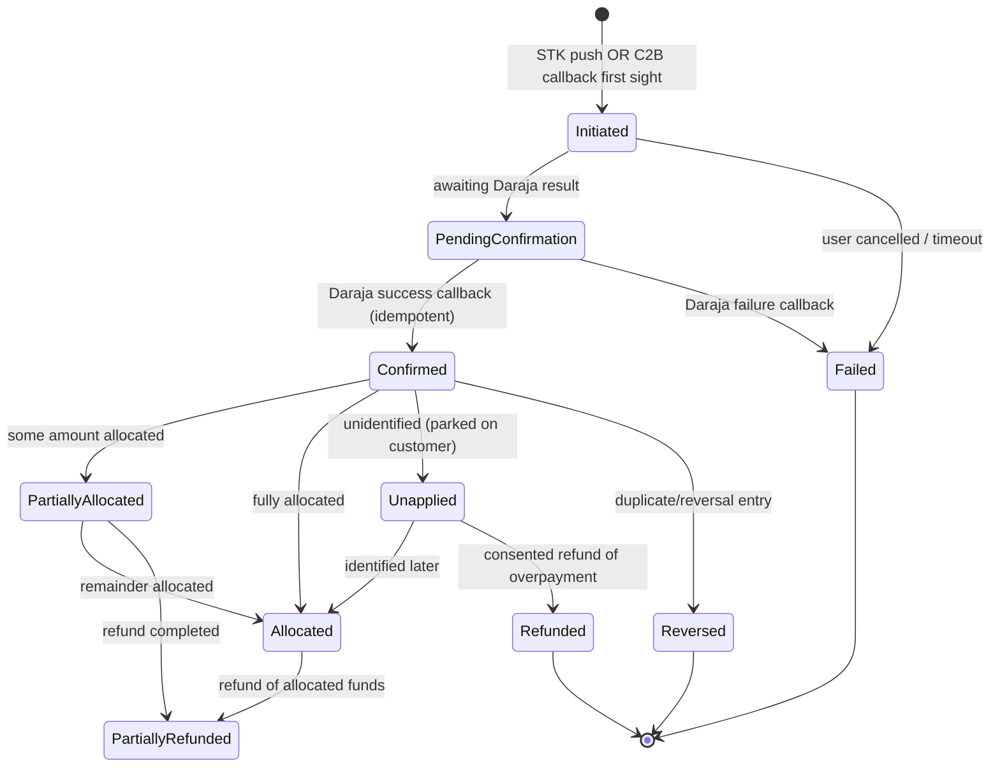
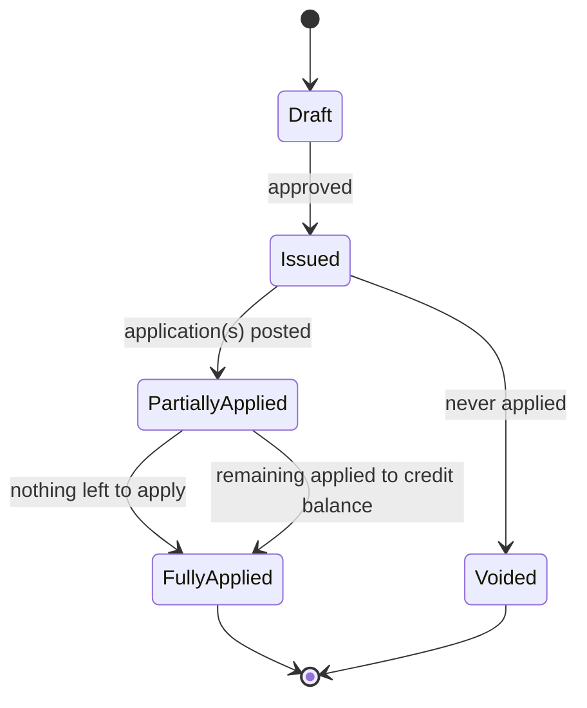
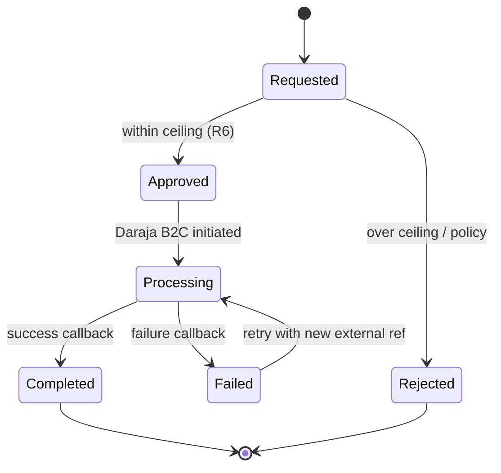
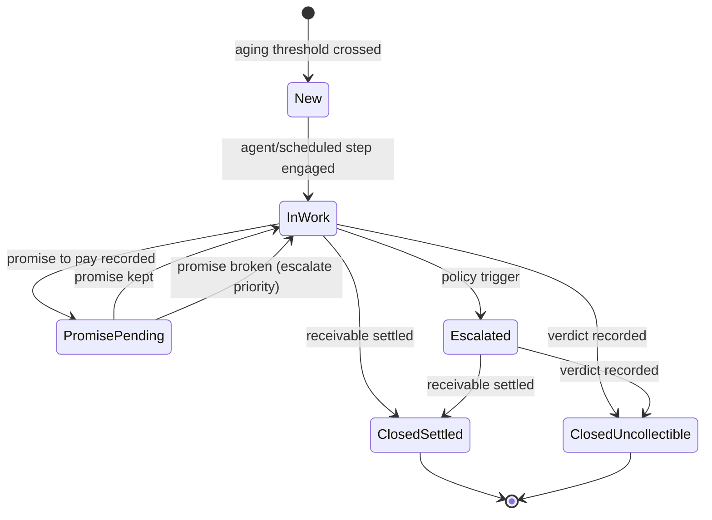
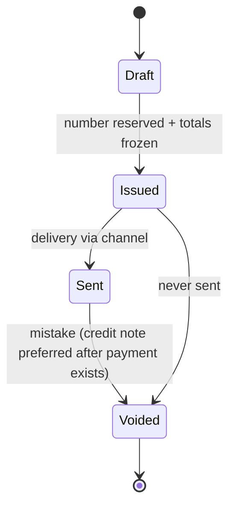

# 03 — State Machines

Every lifecycle in the platform. The code implements these as pure transition functions; illegal
transitions throw `DomainError`. Mermaid renders natively on GitHub.

## Receivable

Notes: `Overdue` is derivable from `dueDate` but stored as a flag for query speed; write-off is a
decision with an owner and reason (H1), never a deletion. Recovery re-opens nothing — it is a
terminal state that records the outcome.

## Payment

Notes: duplicate Daraja callbacks are **expected** (at-least-once, K1). The intake funnel is
idempotent on `(channel, externalRef)` — a duplicate returns the existing Payment (R9, C5).
Unapplied money is never silently dropped: it parks on the customer and feeds the credit
balance decision (C4).

## CreditNote

## Refund

## CollectionsCase

Note (R8 / H6): at most one case may be open per receivable at any instant — enforced in the
case-opening function.

## Invoice

