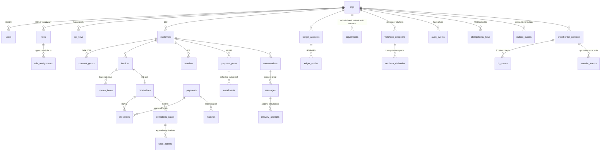

# Fuatilia Data Model — Production PostgreSQL (wave 9, issue #66)

Status: **implemented and proven** — `bash db/validate.sh` boots a real PostgreSQL 16
cluster, applies the suite twice and fires 25 invariant assertions (`ALL GATES GREEN`).
This document is the ER overview and the invariant→constraint map; the code is
`db/migrations/*.sql`.

**Prime directive (ADR-0002): PostgreSQL + the ledger are the only financial source of
truth.** Analytical stores, caches, search indexes and AI systems are projections.

## 1. ER overview by area

Two structural conventions carry the multi-tenancy story everywhere:

1. **Composite org-scoped foreign keys** — children reference parents through
   `(org_id, parent_id)` pairs backed by `(org_id, id)` unique indexes. A row can never
   be linked across tenants, whatever the application does.
2. **Append-only where truth lives** — `ledger_entries`, `allocations` (one-legal-edit
   reversal stamp), `role_assignments`, `case_actions`, `delivery_attempts`,
   `audit_events`, `fx_quotes` reject `UPDATE`/`DELETE` by trigger; corrections are new
   rows (compensating entries, revocation facts).

## 2. Invariant → constraint map

| Invariant (docs/07-invariants.md) | Meaning | DDL enforcement | Proven by |
|---|---|---|---|
| R1 | applied == Σ(active allocations) ≤ original | `ck_receivables_*` + `trg_allocations_sync_receivable` + deferrable `trg_allocations_check_r1` | smoke j3 |
| R2 | no over-allocation of a source of funds | deferrable `trg_allocations_check_r2` (payment confirmed_minor / credit available_minor) | smoke j1 |
| R3 | financial facts are never mutated | append-only triggers on ledger/allocations/role_assignments/case_actions/delivery_attempts/audit/fx_quotes | smoke a1/a2/f1/g2/g3/h2 |
| R4 | double entry: Σdebit == Σcredit | deferrable `trg_ledger_entries_check_r4` | smoke b1 |
| R5/K5 | postings follow the whitelisted matrix | `posting_matrix` + COMMIT proof | smoke c1/c2 |
| R8 | one open case per receivable | denormalized `open_receivable_id` marker + partial UNIQUE index `uq_r8_one_open_case_per_receivable` | smoke e3 |
| R9/C5 | one logical command → one outcome | `uq_idempotency_keys (org_id, scope, key)`; payments `(org_id, external_ref)`; outbox `(org_id, event_id)`; allocations replay key | smoke d2 |
| R10 | no cent created/destroyed across FX | immutable `fx_quotes` snapshots; intent quote frozen at authorization; single-currency entries | smoke h2 |
| §37 | audit trail is tamper-evident | append-only `audit_events` + per-org chain `(seq, prev_hash, hash)` | smoke g1–g3 |
| H4 | plan schedule is deterministic | deferrable Σ(installments) == plan total | 0010 trigger |
| K2 | no outbound message without consent | `ck_messages_outbound_consent` | 0011 CHECK |

## 3. Index strategy — access patterns first

Indexes map 1:1 to the query shapes of the mounted /v1 routes (`src/adapters/http/routes/*`)
and the documented store seams:

- open-case queue: partial index on `(org_id, status, priority) WHERE status IN ('open','in_progress')` (collections route);
- due deliveries: partial `(org_id, next_attempt_at) WHERE state IN ('queued','failed')` (webhook runtime);
- pending outbox: partial `(org_id, created_at) WHERE status='pending'` (publisher loop);
- audit lookups: `(org_id, resource, resource_id, occurred_at)` + actor + action (audit route);
- allocations by receivable/source: partial `WHERE reversed_at IS NULL` (balance math);
- ledger by account: `(org_id, account_id, posted_at)` (statement views);
- promises/dunning: partial open-state index + `(org_id, customer_id, promised_for)`.

Composite org-leading columns make every lookup tenant-safe by construction.

## 4. Money and rounding

- All amounts are `bigint` minor units — floats are banned at the DDL level by convention
  and at the application level by `backend-go/pkg/money` / `src/domain/shared/money.ts`.
- Multi-row monetary proofs (allocation sums, plan schedules, entry balance) run as
  DEFERRABLE INITIALLY DEFERRED constraint triggers so batch writes are proven at COMMIT,
  not mid-statement.
- Fee/FX rounding stays in ONE application-layer point (banker's rounding —
  `RoundBankers`/`divideBankers`); the DDL stores fee components (`fee_flat_minor`,
  `fee_bps`), never a re-rounded derived truth.

## 5. What this model deliberately does NOT do yet

- No row-level-security policies yet — isolation is by composite FK + the application's
  org scope; RLS is the next hardening step (roadmap P1, see `docs/PRODUCT_ROADMAP.md`).
- No partitioning — ledger/outbox/audit are sized for SME volumes; partitioning ships
  when volume data demands it, not for architectural theatre.
- The outbox publisher, webhook delivery worker and dunning schedulers are the next
  platform waves; the schema for all three is already in place.
