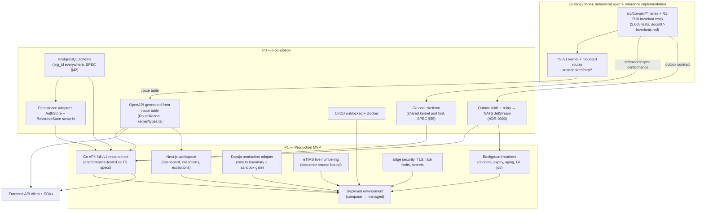

# PRODUCT_ROADMAP — from domain engine to production platform

> **Positioning of the existing TypeScript core (binding for every phase below):** the
> repository at `src/domain/**` is the **behavioral specification + reference implementation
> + invariant catalog** of Fuatilia. R1–R10 ([docs/07-invariants.md](07-invariants.md)) and
> the 2,665 table-driven tests ([docs/BACKLOG.md](BACKLOG.md) waves 1–8) are the normative
> definition of what every production implementation must do. Per SPEC §41/§55
> ([docs/SPEC.md](SPEC.md)), **Go is the production port target**: the Go service re-expresses
> this behavior against PostgreSQL/NATS/Temporal, and the TS lanes remain the executable spec
> every port is conformance-tested against (the `src/adapters/daraja/` conformance-suite
> pattern — fixtures + replay — generalizes to all lanes).
>
> Companion docs: [PRODUCTION_AUDIT.md](PRODUCTION_AUDIT.md) (evidence for every "not
> started" claim below), [ENGINEERING_STATUS.md](ENGINEERING_STATUS.md) (status board),
> [DECISIONS.md](DECISIONS.md) (ADR-0001..0005 behind these choices).

---

## Phase overview

| Phase | Theme | One-line outcome |
|---|---|---|
| **P0** | Foundation — production spine | PostgreSQL truth, Go core skeleton, outbox→NATS, OpenAPI, CI/CD unblocked |
| **P1** | Production MVP — first paying users | Go API + TS-mirrored surfaces complete, Next.js workspace, live Daraja + eTIMS, deployed |
| **P2** | Intelligence in production | Memory/NBA/behavior wired to real event streams, forecasting, reconciliation confidence |
| **P3** | Agentic platform | Governed autonomous collections: agent API execution, copilot, approvals-driven autonomy |
| **P4** | Developer ecosystem | SDKs, embedded collections, webhook runtime, "Collections powered by Fuatilia" |
| **P5** | Africa expansion | Cross-border corridors in production, multi-country rails, data residency |

---

## P0 — Foundation: the production spine

- **Problem.** The verified audit
  ([PRODUCTION_AUDIT.md](PRODUCTION_AUDIT.md) §4) shows the platform's critical gaps: every
  financial fact lives in a process-global in-memory store
  (`src/adapters/http/runtime/resources.ts`), the outbox is a pure in-memory contract
  (`src/domain/events/outbox.ts`), no OpenAPI exists,
  and CI cannot run (account billing lock). Nothing can hold money-state durably yet.
- **User.** The engineering team itself — P0's customer is Fuatilia's own deployability.
- **Value.** Financial facts survive restarts; events get a real delivery fabric; the Go
  port starts against a stable contract instead of guesswork.
- **Acceptance criteria.**
  1. PostgreSQL schema for orgs, users, customers, invoices/receivables, payments,
     allocations, adjustments, ledger postings, cases, promises, disputes, links, comms,
     webhooks, audit — **with `org_id` on every financial row** (closes audit debt D1:
     `src/adapters/http/routes/receivables.ts` header note), FK graph per SPEC §42;
  2. PostgreSQL-backed implementations of the existing `AuthStore`
     (`src/adapters/persistence/filestore.ts` seam) and `ResourceStore`
     (`src/adapters/http/runtime/resources.ts` seam) — same interfaces, swap-in per
     `src/adapters/http/server.ts` options;
  3. Transactional outbox table + relay publishing the typed catalog
     (`src/domain/events/outbox.ts` contract) to NATS JetStream (ADR-0003);
  4. OpenAPI document generated from the `/v1` route table (`RouteRecord` rows in
     `src/adapters/http/kernel/types.ts`) — no hand-parallel spec that can drift (audit debt D9);
  5. Go service skeleton per SPEC §55 (`backend/cmd/api`, `internal/…` lanes mirroring the
     TS lane boundaries) with the shared kernel ported first (`src/domain/shared/money.ts`,
     `src/domain/shared/fx.ts` — banker's rounding + exact rationals) and its tests ported 1:1 from
     `src/domain/shared/*.spec.ts`;
  6. CI green end-to-end again (billing resolved) with the typecheck/test matrix from
     `.github/workflows/ci.yml` plus `npm audit` and a Go build/test job;
  7. Dockerfile + docker-compose (postgres, nats, api, worker) — minimal, not K8s (VISION §5:
     "complexity is earned").
- **Dependencies.** GitHub billing resolved (blocks CI gates only); nothing else — the
  domain is done (F1–F32 merged).
- **Security considerations.** Secrets move out of process-env guesses into a documented
  manager (ADR list: KMS/vault adapter behind the existing `SecretCodec` port,
  `src/domain/auth/user.ts`); DB users least-privilege per service; the audit chain's sink
  becomes durable with an external head-anchor job (`src/domain/audit/chain.ts` truncation
  note).
- **Test strategy.** Port the TS spec files as the Go conformance suite (fixture-first, the
  `src/adapters/daraja/` pattern); contract tests comparing Go and TS outputs on identical
  event streams; crash/restart tests for the outbox relay and stores (the
  `src/adapters/persistence/replay.spec.ts` quarantine taxonomy is the template).
- **Observability requirements.** Structured request logs with the kernel's `requestId`
  (`src/adapters/http/kernel/types.ts`), outbox-lag and dead-letter metrics, OpenTelemetry
  traces spanning relay→API; the kernel's `onError` sink (`src/adapters/http/server.ts`)
  becomes the wire-in.

## P1 — Production MVP: first paying users

- **Problem.** Even after P0, 15 of 32 capability lanes have no HTTP surface and no frontend
  exists ([PRODUCTION_AUDIT.md](PRODUCTION_AUDIT.md) §3.2) — an SME cannot onboard, invoice,
  or collect through Fuatilia yet.
- **User.** Kenyan SME finance/collections operator (the README's "WHO owes us / HOW MUCH /
  WHEN / WHAT next" persona, `README.md` "Why this exists").
- **Value.** The four questions answered on live data: invoices in, M-Pesa money
  reconciled, follow-ups executed, ledger balanced.
- **Acceptance criteria.**
  1. Go API mounts the **missing /v1 resources** to parity with SPEC §38's list
     (`docs/SPEC.md` §38): customers, invoices, ledger, adjustments, payment-links,
     promises, disputes, notifications (comms), webhooks — handlers are behavior-verified
     against the TS lanes' spec files (behavioral-spec role above);
  2. Next.js frontend (SPEC §41/§45) with the minimal workspace: executive dashboard
     (§46), collections workspace (§48), reconciliation exceptions (§49) — read paths first,
     then actions;
  3. **Daraja production adapter**: real C2B confirmation/validation + STK endpoints behind
     the `src/adapters/daraja/wire.ts` untrusted-input boundary (`src/adapters/daraja/wire.ts`), callback URL
     provisioning, credentials via the secret manager; the conformance suite
     (`src/adapters/daraja/conformance.ts`) runs against the sandbox as a pre-deploy gate;
  4. **eTIMS live numbering**: the `createNumberingService` sequence source
     (`src/domain/consent/etims.ts`) bound to a Postgres `SELECT … FOR UPDATE` counter (the
     KRA-reservation option documented there);
  5. Background workers exist: dunning ladder executor (`src/domain/promises/dunning.ts`
     dueSteps), link expiry sweeper (`src/domain/paymentlinks/link.ts` `expireIfDue`),
     aging/overdue triggers (`src/domain/receivables/aging.ts`), GL reconciliation job
     (`src/domain/ledger/reconciliation.ts`) — all cron/Temporal-driven per ADR-0004;
  6. Production Daraja replay drill: the at-least-once guarantee (R9) holds against live
     duplicate callbacks (`payments.duplicateCallbackObserved` tripwire visible in logs).
- **Dependencies.** P0 (all), Safaricom Daraja production credentials, KRA eTIMS onboarding,
  TLS termination + rate limiting (audit §5.2 items 1–2).
- **Security considerations.** Rate limiting at the edge (audit gap), webhook HMAC signing
  keys via the manager (`src/domain/webhooks/signing.ts` contract), consent enforcement on
  every automated send (K2: `src/domain/communications/guard.ts` +
  `src/domain/collections/actions.ts` DUNNING_CONSENT_REQUIRED), DPA 2019 data-handling
  register for customer PII (`src/domain/consent/dsar.ts` exists for exactly this).
- **Test strategy.** Environment-graded: unit = ported lane specs; integration = testcontainers
  Postgres/NATS; contract = Daraja sandbox fixtures replayed through the real adapter;
  failure = SPEC §58 chaos cases (callback duplication, broker outage, restart mid-write).
- **Observability requirements.** Per-phase SLOs defined and dashboards built (SPEC §67):
  intake duplicate-rate, reconciliation match-rate, dunning block-rate (consent), dead-letter
  counts for comms + webhooks (`comms.messageDeadLettered`,
  `webhook.deliveryDeadLettered` events), outbox lag; alerting on any R1/R2 violation
  detector (allocation sum identity).

## P2 — Intelligence in production

- **Problem.** The intelligence lanes are domain-complete but consume caller-projected facts
  (`src/domain/memory/README.md`: "The caller (adapter/projection job) reduces raw lane
  events into these facts") — those projection jobs don't exist yet, so the platform answers
  with data but without foresight.
- **User.** The collections manager deciding "what should we do next" and the finance lead
  forecasting cash-in.
- **Value.** Priorities, predictions and forecasts on live events — with the evidence trail
  that makes them auditable (every memory claim carries `computedFrom` event ids).
- **Acceptance criteria.**
  1. Event projection pipeline turns the NATS stream into the ten fact types of
     `src/domain/memory/facts.ts`;
  2. NBA served on live data with policy filter + feedback loop closing
     (`src/domain/nba/rank.ts`, `src/domain/nba/feedback.ts`);
  3. Reconciliation confidence scoring on top of the match core
     (`src/domain/payments/reconciliation.ts`) with a human-corrections-as-training-data loop
     (VISION §3.6);
  4. Cash-flow forecast + at-risk AR projections from `src/domain/projections/` — always
     labeled as projections, never balances (F14 acceptance rule, `docs/BACKLOG.md`);
  5. Model governance register (SPEC §51) for any ML component; the deterministic/AI divide
     of VISION §4 enforced in code review + policy engine.
- **Dependencies.** P1 (live events), AI/ML stack decision (SPEC §41 AI/ML — Python gateway).
- **Security considerations.** AI outputs are read-only by construction (README principle 2;
  `src/domain/agent/README.md` header: "Executing a recommendation is other lanes' work,
  gated by the policy engine"); PII minimization in features; redaction reuse from
  `src/domain/audit/redact.ts`.
- **Test strategy.** Golden-event fixtures replayed through projections must reproduce
  claims byte-for-byte (the memory lane's determinism guarantee); backtests for scoring
  weights; anomaly precision/recall evals before any automated action consumes them.
- **Observability requirements.** Feature-freshness lag, claim-recompute failures, forecast
  error tracking, feedback-loop volume; every served recommendation logs its evidence ids.

## P3 — Agentic platform (controlled autonomy)

- **Problem.** VISION §3.5's "autonomous collections — controlled, not free" is the thesis
  differentiator; the governance rails exist (`src/domain/policy/`, `src/domain/approvals/`,
  `src/domain/audit/`) but the execution path and copilot surface don't.
- **User.** AI copilot users (operators) and AI agents (integrators) — the VISION §2
  `Human / AI Copilot → Policy Engine → Fuatilia → Workflow` flow.
- **Value.** Low-risk repetitive collections work runs itself; risky work queues for humans
  with full context; every action is policy-evaluated, approval-gated and audit-chained.
- **Acceptance criteria.**
  1. `POST /agent/v1/collections/actions/preview|execute` (VISION §3.8) implemented with the
     exact VISION §3.9 chain: recommendation → policy engine (`src/domain/policy/engine.ts`)
     → approval quorum (`src/domain/approvals/`) → execution lanes → `audit` record;
  2. Copilot UX (chat over the agent capability queries `src/domain/agent/`) where every
     answer renders its evidence (memory claims);
  3. Autonomous-send rules live: policy allow-lists per channel/amount/risk with the K2
     consent gate still underneath (defense in depth: policy allow ≠ consent waived);
  4. "Do nothing" is representable and wins sometimes (`src/domain/nba/README.md` — it's a
     first-class candidate);
  5. Incident tooling: kill-switch that pauses all automated sends (consent-gate reuse) and
     replays the audit chain for postmortems.
- **Dependencies.** P2 (features feeding NBA), P1 execution surfaces (comms, links, plans).
- **Security considerations.** ADR-0005 (AI never mutates financial truth); principal
  separation for agent identities (API keys with narrow scopes — `src/domain/auth/apikeys.ts`
  scopes vocabulary); rate limits per principal; the escalation guard
  (`AUTH_ESCALATION_BLOCKED`) applies to agent-created principals too.
- **Test strategy.** Policy decision tables over adversarial action requests (the
  `engine.spec.ts` 72-test suite is the seed); approval-quorum bypass attempts; red-team
  prompts for the copilot; end-to-end "AI proposes, human approves, system executes, audit
  proves" scenario tests.
- **Observability requirements.** Autonomy metrics: automation rate, override rate,
  approval latency, blocked-by-policy rate (`policy.decisionRecorded` stream), consent-block
  rate; per-agent spend/cost dashboards.

## P4 — Developer ecosystem

- **Problem.** VISION §7 names the Fuatilia API as "the biggest long-term opportunity"; the
  developer-platform domain exists (`src/domain/webhooks/` registry/signing/attempts; apikey
  issuance) but there is no portal, SDKs or webhook runtime.
- **User.** Partner platforms (MjengoOS-style SaaS embedding "Collections powered by
  Fuatilia", VISION §6) and integrators (ERPs, banks).
- **Value.** Distribution without a sales channel: partners embed AR intelligence; usage
  metering becomes revenue (VISION §7 tiers 5–6).
- **Acceptance criteria.**
  1. OpenAPI-derived TS + Go SDKs (P0 artifact is the source of truth);
  2. Webhook delivery runtime: the pure ladder of `src/domain/webhooks/attempts.ts` executed
     by workers with HMAC signatures (`src/domain/webhooks/signing.ts`), dead-letter UI,
     manual replay (idempotent re-enqueue rules already specified there);
  3. Developer portal: key management over the mounted `/v1/auth/api-keys` routes,
     endpoint registration, event documentation generated from the full event catalog
     (closing audit debt D6);
  4. Embedded components: receivables summary + payment links widgets;
  5. Usage metering aligned to VISION §7 (calls/entities/executions).
- **Dependencies.** P0 (OpenAPI), P1 (resources mounted), P3 (agent API for premium tiers).
- **Security considerations.** Scope-minimal API keys (no wildcards — enforced in
  `src/domain/auth/apikeys.ts`), webhook secret rotation, org isolation tests on every
  partner surface (R8-style cross-org refusals already pattern-tested in
  `src/adapters/http/routes/collections.spec.ts`).
- **Test strategy.** SDK golden tests against the OpenAPI fixture; webhook delivery chaos
  (receiver 500s, timeouts — the ladder table); multi-tenant penetration checklist.
- **Observability requirements.** Per-key usage dashboards, webhook success/latency
  percentiles, dead-letter aging, quota-rejection metrics.

## P5 — Africa expansion

- **Problem.** The cross-border kernel is domain-complete (`src/domain/crossborder/`: exact
  rational quotes with expiry windows, idempotent submit, fee arithmetic pinned by tests)
  but has no corridors, no rails, no regulatory footprint beyond Kenya.
- **User.** SMEs trading across East African borders; partner PSPs moving the money.
- **Value.** New corridor revenue on the same truth engine; the ledger-first core is
  currency-agnostic by construction (R10 + FX snapshots, `src/domain/shared/fx.ts`).
- **Acceptance criteria.**
  1. Two live corridors with production quotes + settlement intents end-to-end (quote
     freeze-at-authorization semantics preserved);
  2. Multi-currency ledger reporting with realized gain/loss posted from the FX module's
     `postRealizedGainLoss` path (`src/domain/shared/fx.ts`);
  3. Localization pack per SPEC §32 (languages, formats) and USSD flows reused per market
     (`src/domain/ussd/flows.ts` — port-injected, channel-agnostic);
  4. Data-residency option per market (ADR-0002 keeps one truth store per region; ClickHouse
     remains derived).
- **Dependencies.** P1 (production payments), P4 (partner rails integration), regulatory
  licenses per corridor.
- **Security considerations.** Corridor credentials in the manager; per-region audit
  anchoring; sanctions/watchlist screening hooks before intent authorization (new lane, same
  refusal-as-value style).
- **Test strategy.** Cross-currency property tests ported from `src/domain/shared/fx.spec.ts`
  (banker's ties, scale gaps); corridor failure drills (rate-window expiry mid-flow — the
  `quote.spec.ts` overlap refusal is the seed).
- **Observability requirements.** Quote-expiry rate, settlement mismatch rate
  (`SETTLEMENT_*` refusals), per-corridor latency and failure taxonomy.

---

## Dependency graph — P0/P1 (build order)

Rules the graph encodes: the TS domain is upstream of everything (it is the spec — ADR-0001);
PostgreSQL is the only financial source of truth (ADR-0002); the OpenAPI contract precedes
both the Go API and the frontend client so they can be built in parallel against it; workers
consume the outbox, never poll domain tables.

---

## What this roadmap deliberately does NOT do

- It does not rewrite the domain: the TS lanes stay the executable spec and conformance
  harness (cheaper than re-deriving 2,665 tests of behavior).
- It does not deploy Kubernetes before scale justifies it (VISION §5: "complexity is
  earned, not deployed on day one").
- It does not build lending or financing products first (VISION §7 tier 10: "Do not build
  lending first").
